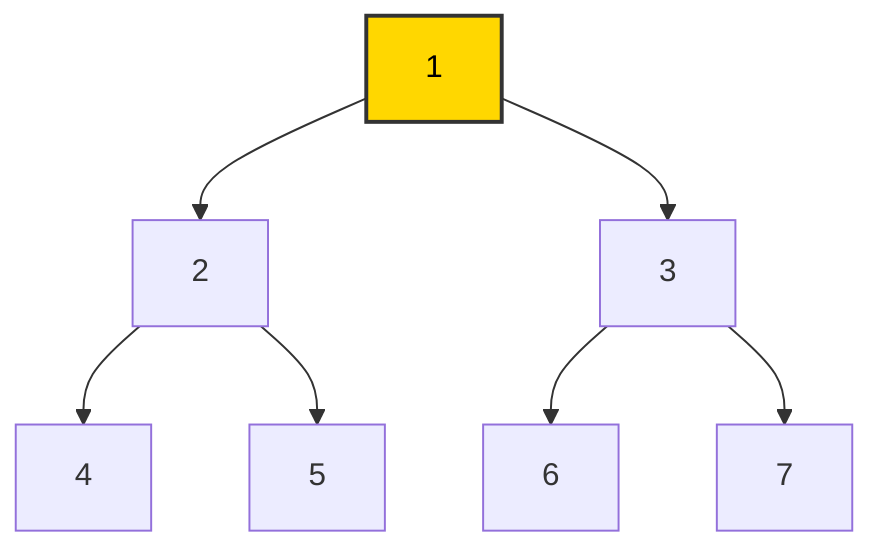
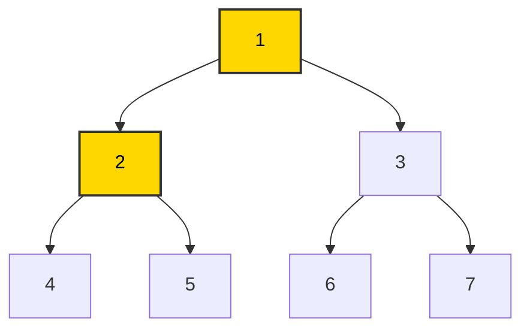
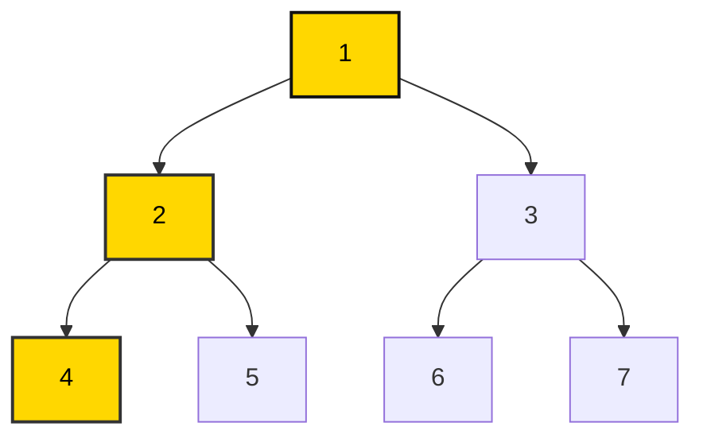
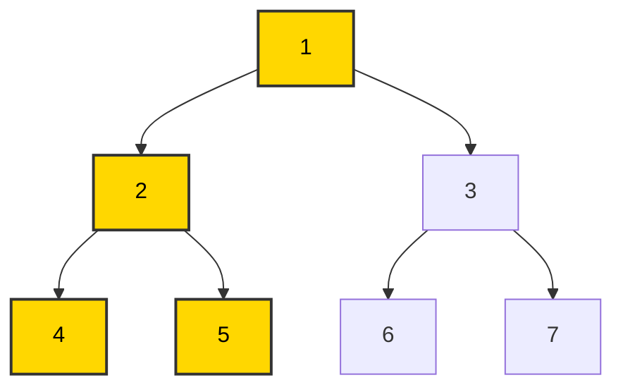

## **문제 요약**
### 출처: [(BOJ)2606 - 바이러스](https://www.acmicpc.net/problem/2606)  
  
컴퓨터의 수 $V$와 네트워크에서 서로 연결된 정보 $E$가 주어진다. 어느 한 컴퓨터가 바이러스에 감염되면, 네트워크를 통해 연결된 모든 컴퓨터가 감염된다고 한다.  **1번 컴퓨터가 바이러스에 감염되었을 때, 이를 통해 감염되는 컴퓨터의 개수를 구하는 문제이다.**
  
## **접근 과정**
  
### **1. DFS(깊이 우선 탐색, 재귀)**

DFS는 그래프에서 모든 경로를 탐색하는 완전 탐색 기법 중 하나로, 이전 포스트에서 많이 다뤘던 **재귀 호출 방식**과 동일한 원리로 동작을 한다. 이해를 돕기 위해 **이진 트리**를 활용하여 DFS의 동작 과정을 설명을 해보겠다.

**1. 1번 노드 방문**

**2. 2번 노드 방문**

**3. 4번 노드 방문**

**4. 4번 노드에서 더 이동할 수 없어 2번 노드로 돌아가 5번 노드 방문**


위의 동작 과정을 보면, 앞서 얘기했던 **재귀 호출**과 동일한 원리로 동작한다는 말을 직관적으로 이해할 수 있을 것이다. 재귀를 활용할 때처럼 **"하나의 경우"**, **"또 다른 경우"** 로 나누어 접근하듯, DFS 또한 **"왼쪽으로 가는 경우"** , **"오른쪽으로 가는 경우"** 로 나뉘며, 동일한 방식으로 탐색이 진행됨을 알 수 있다! 아래는 이를 바탕으로 구현한 코드이다.

### **코드 구현**
  
```python
import sys
sys.setrecursionlimit(10000)

V = int(input())
E = int(input())

graph = [[] for _ in range(V+1)]
visited = [0 for _ in range(V+1)]

for _ in range(E):
    A, B = map(int, input().split())
    graph[A].append(B)
    graph[B].append(A)

def recursion(node):
    global answer
    
    for next in graph[node]:
        if visited[next] == 0:
            visited[next] = 1
            answer += 1
            recursion(next)
                     
answer = 0
visited[1] = 1
recursion(1)
print(answer)
```

## **회고**
이진트리에서는 경우가 두 가지로 나뉘지만, 그래프 상에서는 1번 노드에 수많은 노드가 붙어 있을 수도 있다. 그렇기에 안에 반복문으로 모든 경우에 대해 접근하도록 해야 한다.


