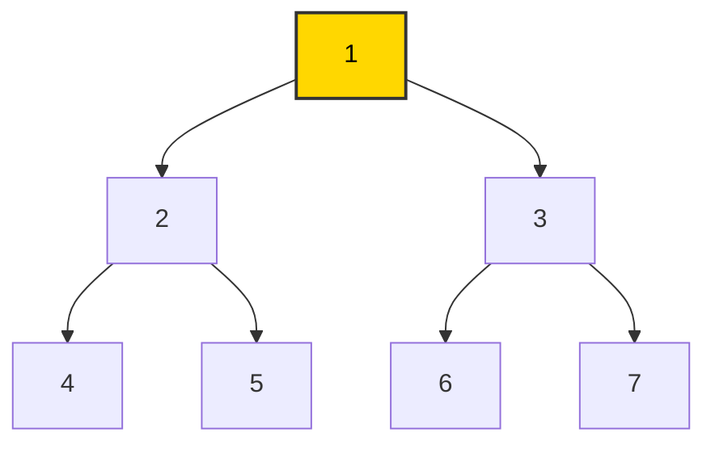
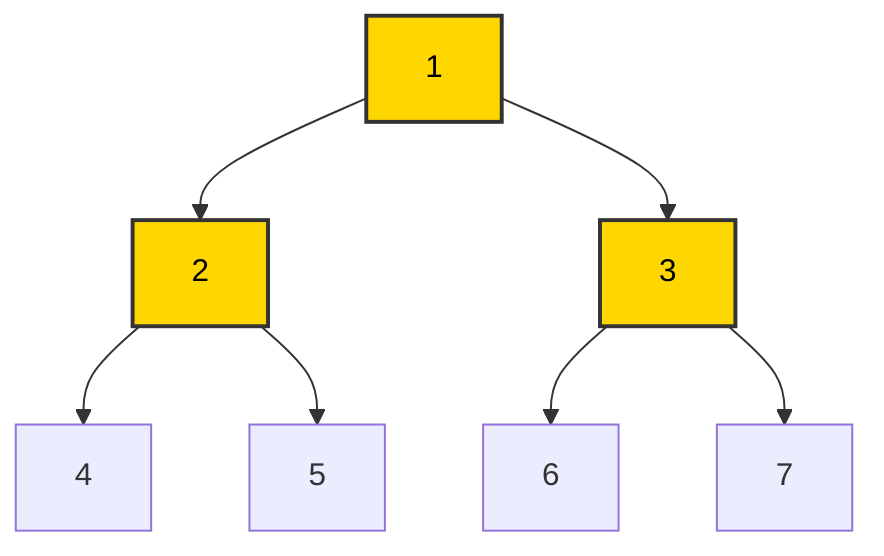
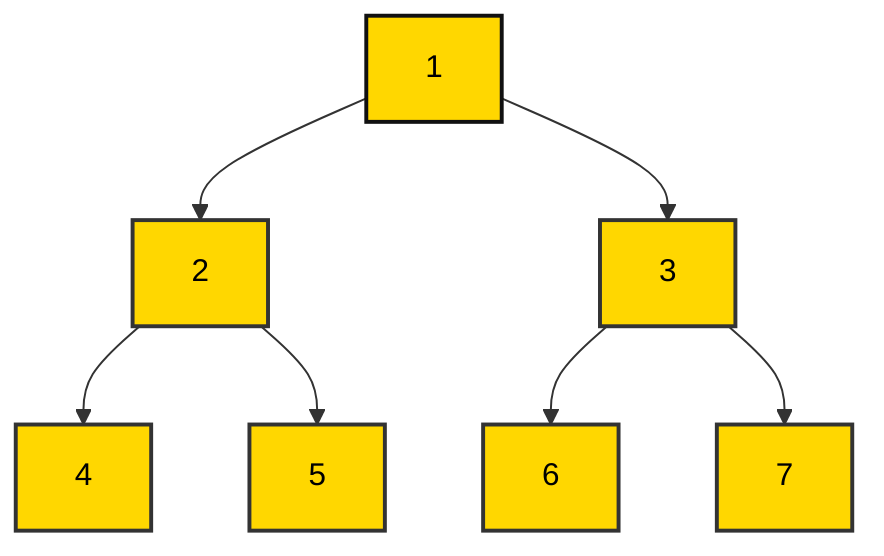

## **문제 요약**
### 출처: [(BOJ)2178 -미로 탐색](https://www.acmicpc.net/problem/2178)  
  
$N \times M$ 크기의 미로가 주어진다. 미로의 각 칸은 $1$ 또는 $0$으로 이루어져 있다. $1$은 이동할 수 있는 칸을 의미하고, $0$은 이동할 수 없는 칸을 의미한다. 이때, $(1, 1)$에서 $(N, M)$으로 이동할 때 지나야 하는 최소 칸의 수를 구하는 문제이다.

> 시작 위치와 끝 위치도 세야 한다.  
> 항상 도착위치로 이동할 수 있는 경우만 입력으로 주어진다. 
  
## **접근 과정**

### **1. DFS(재귀)**

문제를 보자마자 [이전포스트](https://mcw1415.github.io/posts/baekjoon-2606/)에서 다뤘던 DFS를 시도해보았다. 하지만 결과는 **시간초과**였다..  사실, 아래 코드는 DFS라고 보기 어렵다.  그 이유는 **방문 처리를 하지 않았기 때문**이다.

DFS에서는 보통 방문 처리를 해야 하지만, **최단 거리를 갱신하려다 보니 방문 처리를 할 수 없었다.**  이로 인해 이미 방문했던 곳을 다시 방문하면서 시간 초과가 발생한 것 같다.

### **시도한 코드**

```python
N, M = map(int, input().split())
graph = [list(map(int, input().rstrip())) for _ in range(N)]
dist = [[1e9 for _ in range(M)] for _ in range(N)]

def recursion(y, x):
        
    for mv_y, mv_x in [(-1, 0), (1, 0), (0, -1), (0, 1)]:
        dy, dx = mv_y + y, mv_x + x
        if 0<= dy < N and 0<= dx < M:
            if graph[dy][dx] == 1:
                if dist[dy][dx] > dist[y][x] + 1:
                    dist[dy][dx] = dist[y][x] + 1
                    recursion(dy, dx)
              
dist[0][0] = 1  
recursion(0, 0)
print(dist[N-1][M-1])
``` 

  
### **2. BFS(큐)**

BFS는 그래프에서 모든 경로를 탐색하는 완전 탐색 기법 중 하나이고, DFS와는 달리, 단계별로 퍼지면서 탐색을 하는 알고리즘이다. 이해를 돕기 위해 **이진 트리**를 활용하여 BFS의 동작 과정을 보여주겠다!

**1. 1번 노드 방문**

**2. (2, 3)번 노드 방문(queue에 먼저 저장된 순)**

**3. (4, 5, 6, 7)번 노드 방문(queue에 먼저 저장된 순)**


위의 동작 과정을 보면, BFS의 원리를 쉽게 이해할 수 있을 것이다.

DFS에서는 두 개의 경로(돌아가는 루트와 빠른 루트)가 있을 때, **돌아가는 길을 선택하고 방문 처리를 하면 거리 갱신에 문제가 생길 수 있다.**  반면, **BFS는 주변의 모든 가능성을 고려하며 탐색하기 때문에, 항상 최단 경로를 선택할 수 밖에 없다.** 단, 모든 칸의 가중치가 같기 때문에 가능하다. 


### **코드 구현**
  
```python
from collections import deque

N, M = map(int, input().split())
graph = [list(map(int, input().rstrip())) for _ in range(N)]
visited = [[0 for _ in range(M)] for _ in range(N)]
dist = [[0 for _ in range(M)] for _ in range(N)]

q = deque()
q.append([0,0])
visited[0][0] = 1
dist[0][0] = 1

while q:
    _y, _x =  q.popleft()
    
    for mv_y, mv_x in [[-1, 0], [1, 0], [0, -1], [0, 1]]:
        dy, dx = _y + mv_y, _x + mv_x
        if 0 <= dy < N and 0 <= dx < M:
            if graph[dy][dx] == 1 and visited[dy][dx] == 0:
                visited[dy][dx] = 1
                dist[dy][dx] = dist[_y][_x] + 1
                q.append([dy,dx])

print(dist[N-1][M-1])
```

## **회고**
DFS로 어떻게든 해결해보려고 많은 고민들을 해보느라 시간을 많이 보낸 것 같다. 그래도 최단 거리를 구하는 문제에서는 BFS로 접근하는 것이 훨씬 효율적이라는 것을 알게 되었다. 


